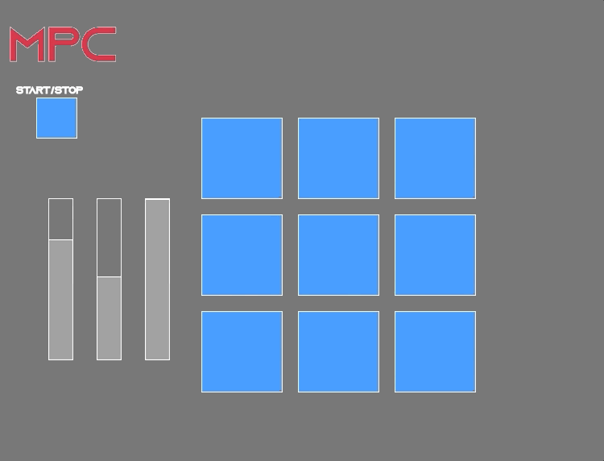
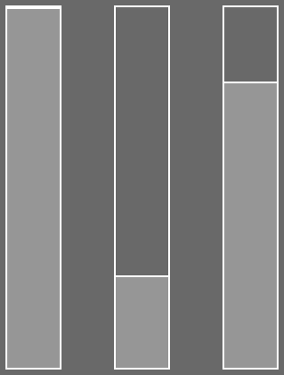

# MPC

## Overview

A music production controller (MPC) written in P5.js

**Live Demo:** https://zixi7.csb.app/ (Does not work in Chrome)

**Video Demo:** https://vimeo.com/439236102

## Features

**Sounds** 

In total, there are 9 different sounds to choose from.

**Parameters**

There are also 3 audio effect parameters which, are amplitude, delay, and a low pass filter. 

